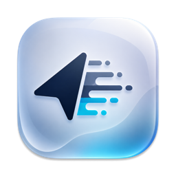

<div align="center">



# LeftHandy

**Left-handed cursor and mouse button support for macOS**

[](https://github.com/writronic/LeftHandy/releases/latest)


[](LICENSE)
[](https://github.com/sponsors/writronic)

</div>

---


LeftHandy is a menu bar app that adds left-handed mouse and cursor support to your Mac.

Requires **macOS 14 Sonoma** or later.

## Features

- **Cursor Flip** — Mirrors all system cursors (arrow, pointer, resize handles, crosshair, etc.) so the tip points naturally for left-handed use
- **Mouse Button Swap** — Swaps left and right click in real time via a low-level event tap — no System Settings changes needed
- **Persistence** — Automatically reapplies flipped cursors after display reconfiguration, app switches, and wake from sleep
- **Menu Bar App** — Lives entirely in the menu bar with a minimal dropdown: Active toggle, Swap toggle, Start at Login, About, and Quit
- **Start at Login** — Starts automatically when you log in to your Mac
- **Welcome & Onboarding** — First-launch flow walks you through granting Accessibility permission with real-time status monitoring
- **macOS Tahoe Ready** — Full support for macOS 26 Tahoe

## Quick Start

Get up and running in under a minute:

### 1. Install

Download the latest `LeftHandy.dmg` from the [Releases page](https://github.com/writronic/LeftHandy/releases/latest), open it, and drag LeftHandy to your Applications folder. The app ships as a **universal binary** (Apple Silicon + Intel). Every release is **code-signed, notarized, and stapled** by Apple.

### 2. Grant Permission

On first launch, LeftHandy opens a welcome window asking for **Accessibility** permission. Click **Allow for Accessibility** to open System Settings, then add LeftHandy to the allowed list. The app detects the permission change automatically.

### 3. Use It

That's it. Toggle **Active** to flip your cursors and toggle **Swap Mouse Buttons** to swap left/right click. Both settings persist across restarts.

> [!IMPORTANT]
> LeftHandy requires **Accessibility permission** to function. Without it, the app cannot flip cursors or swap mouse buttons. You can grant this in **System Settings → Privacy & Security → Accessibility**.

## Development

### Build from Source

1. Clone the repository:
   ```sh
   git clone https://github.com/writronic/LeftHandy.git
   cd LeftHandy
   ```
2. Open `LeftHandy.xcodeproj` in Xcode 16+.
3. Build and run the **LeftHandy** scheme.

> [!NOTE]
> LeftHandy has no external dependencies. The project builds with only Apple frameworks.

## Contributing

Contributions are welcome! Please read [CONTRIBUTING.md](.github/CONTRIBUTING.md) before getting started.

### Bug Reports & Feature Requests

Search existing [issues](https://github.com/writronic/LeftHandy/issues) before opening a [new one](https://github.com/writronic/LeftHandy/issues/new/choose). Provide clear reproduction steps for bugs and a concise rationale for feature requests.

### Code

Fork the repository, create a feature branch, and open a pull request. Keep changes focused and include relevant tests.

## License

LeftHandy is available under the [GPL-3.0 license](LICENSE).

---

<div align="center">

**Made with ❤️ by [Writronic](https://writronic.com)**

</div>
